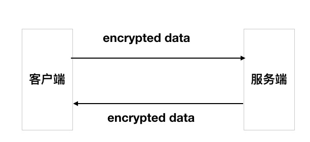

## 概述
HTTPS(http-on-tls)
本文将分成两部分去理解Https  

    1. 为什么说https是安全的
    2. https连接建立的全过程
-------
## 第一部分
### 1. http为什么是不安全的？
http协议使用明文传输，交互过程以及数据传输都没有进行加密，通信双方也没有进行认证，所以很容易遭遇劫持、监听、篡改，严重情况下，会造成恶意的流量劫持等问题，甚至造成个人隐私泄露。
### 2. https如何保证安全？
- **对称加密**  
好了，前面我们说，http是明文传输的，那我们对http传输的明文加密是不是就可以了呢？首先我们来看一下对称加密的例子：
  
这样看起来客户端和服务端传输的数据都是经过加密的，但是服务端在制定加密key之后，还是以明文的方式传输给客户端，那么黑客很容易把这个key截获，那么所谓的加密就只是一个笑话了。又或许有人说，服务端可以把这个key加密后传输给客户端，那么客户端又该如何解开这个密文，得到真正的key呢？所以这种方法是行不通的。
- **非对称加密 + 对称加密**  
    `首先，我们先对非对称加密有个大致的了解。在非对称加密的算法里，公钥和私钥是一对，公钥加密的数据，只有私钥才可以解密；而私钥加密的数据，也只有公钥才可以解密。`

## SSL和TLS的概念和区别
- SSL(Secure Socket Layer,安全套接字层)，位于TCP与应用层之间，为数据通信提供安全。SSL协议分为两层：
    1. ssl记录协议：位于传输层之上，为高层协议提供封装、压缩、加密等基本功能的支持。
    2. ssl握手协议：位于ssl记录协议之上，用于在实际的数据传输开始前，通讯双方进行身份认证、协商加密算法，交换加密秘钥等
- TLS(Transport Layer Security，传输层安全协议) SSL3.0的后续版本
## 对称加密和非对称加密的概念
各自的优缺点：
- 对称加密：性能较好，但由于需要让客户端掌握密钥，故需要将密钥在网络上传输，所以不安全。
- 非对称加密：限制了公钥的能力,即用公钥加密后只能在服务端用私钥解密,这样使得”解密的能力仅保留在服务端“,缺点也很明显,这样只能实现单向加密,客户端没有解密能力.另外由于”非对称加密”涉及到“复杂数学问题”,所以性能相对而言较差.
## CA 证书的原理及用途
- 证书：
- CA：
- CA证书：
- 证书链：
- 根证书：
## 密钥协商过程
由于非对称加密的速度比较慢，所以它一般用于密钥交换，双方通过公钥算法协商出一份密钥，然后通过对称加密来通信，当然，为了保证数据的完整性，在加密前要先经过HMAC的处理。

#### 1. 客户端发出请求（client hello）
client hello消息包括：
- TLS版本 version
- 客户端生成的一个随机数random
- 客户端支持的加密套件 cipher suite：格式为TLS_DHE_RSA_WITH_DES_CBS_SHA,用WITH把密钥交换算法、加密算法、散列算法分开。
- 客户端支持的压缩算法 compression method
- session id
#### 2.服务器回应(server hello)
server hello消息包括：
- TLS版本号 取客户端支持的最高版本和服务器支持的最高版本中的较低者
- 服务器生成的一个随机数 random
- session id
- 从客户端支持的密码套件中选择的一个密码套件
- 从客户端支持的压缩算法中选择的一个压缩算法
#### 3. 服务器的鉴别与密钥交换
- 证书(certificate): 服务器将数字证书和整个证书链发送给客户端，使客户端能够验证服务器的身份。
- 密钥交换(server key exchange): 可选，这里视密钥交换算法而定
- 证书请求(certificate request):有些场景比如说银行，需要验证客户端的证书
- server hello done: 没有消息体
#### 4. 客户端鉴别与密钥交换
- 证书(certificate): 为了对服务器证明自身，客户要发送一个证书信息，这是可选的。
- 客户端密钥交换(client key exchange): 客户端将预备主密钥(master key)发送给服务器，这里会用服务器的公钥加密，实际上也是一个随机数。
- 证书验证(certificate verify): 可选
#### 5. 客户端完成
- change cipher suite: 告知对端，已经切换到之前协商好的加密套件的状态，可以使用之前协商好的加密套件对称加密数据并传输了。
- encrypted handshake message: 客户端会使用之前协商好的加密套件和session secret将之前的握手消息加密，发送给服务端，此数据是为了在正式传输数据之前，对刚刚建立起来的加密通道进行验证。
#### 6. 服务端完成
同客户端

## 身份认证
#### 1. 数字证书认证
- 数字签名的签发。首先是使用哈希函数对待签名内容进行安全哈希，生成消息摘要，然后使用CA自己的私钥对消息摘要进行加密。

- 数字签名的校验。使用CA的公钥解密签名，然后使用相同的签名函数对签名证书内容进行签名，并和服务端数字签名里的签名内容进行比较，如果相同就认为校验成功。
#### 2. 数据完整性验证
MAC算法是在密钥参与下的数据摘要算法，能将密钥和任意长度的数据转换为固定长度的数据。发送者在密钥的作用下，利用MAC算法计算出消息的MAC值，并将其添加在需要发送的消息之后，并发送给接收者。接收者利用同样的密钥和MAC算法计算出消息的MAC值，并与接收到的MAC值比较。如果二者相同，则报文没有改变；否则，报文在传输过程中被修改或者污染，接收者将丢弃该报文。

## 参考
https://wetest.qq.com/lab/view/110.html
https://blog.csdn.net/alinyua/article/details/79476365
https://www.cnblogs.com/hjbf/p/10248388.html