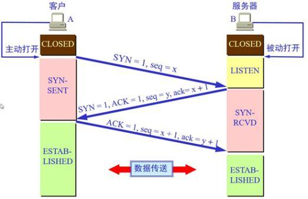

[TOC]
# TCP和UDP的区别
> TCP是面向连接的、可靠的、基于字节流的传输层协议
> UDP是无连接的、基于数据报的传输层协议
# TCP三次握手的过程
三次握手的本质是确认双方都具有发送和接受的能力.

> - 从最开始双方都处于CLOSED状态。然后服务端开始监听某个端口，进入了LISTEN状态。
> - 然后客户端主动发起连接，发送 SYN , 自己变成了SYN-SENT状态。
> - 服务端接收到，返回SYN和ACK(对应客户端发来的SYN)，自己变成了SYN-REVD。
> - 之后客户端再发送ACK给服务端，自己变成了ESTABLISHED状态；服务端收到ACK之后，也变成了ESTABLISHED状态。

### 为什么不是两次
> 根本原因： 服务端无法确认客户端的接收能力。

现假定一种异常情况，即A发出的SYN报文段并没有丢失，而是在某些网络节点长时间滞留了，以致延误到连接释放后的某个时间才到达B。本来这是一个早已失效的报文段。但B收到此失效的连接请求报文段后，却误以为是A又发出一次新的连接请求，于是就向A发出确认报文段，同意建立连接。

由于现在A并没有发出建立连接的请求，因此不会理睬B的确认，也不会向B发送数据，但B却以为新的运输连接已经建立了，并一直等待A发来的数据。B的许多资源就这样白白浪费了。

### 三次握手过程中可以携带数据吗
> 第三次握手的时候，可以携带。前两次握手不能携带数据。

如果前两次握手能够携带数据，那么一旦有人想攻击服务器，那么他只需要在第一次握手中的 SYN 报文中放大量数据，那么服务器势必会消耗更多的时间和内存空间去处理这些数据，增大了服务器被攻击的风险。
第三次握手的时候，客户端已经处于ESTABLISHED状态，并且已经能够确认服务器的接收、发送能力正常，这个时候相对安全了，可以携带数据。

### 同时打开会怎样

发完SYN，两者的状态都变为SYN-SENT。

在各自收到对方的SYN后，两者状态都变为SYN-REVD。

接着会回复对应的ACK + SYN，这个报文在对方接收之后，两者状态一起变为ESTABLISHED。

只会建立一个连接。

### 半连接队列和SYN Flood的关系
三次握手前，服务器的状态从ClOSED变为LISTEN状态，同时在内部创建了两个队列：**半连接队列** 和 **全连接队列**。
##### 半连接队列（SYN队列）
当客户端发送SYN到服务端，服务端收到以后回复ACK和SYN，状态由LISTEN变为SYN_RCVD，此时这个连接就被推入了SYN队列，也就是半连接队列。
##### 全连接队列
当客户端返回ACK, 服务端接收后，三次握手完成。这个时候连接等待被具体的应用取走，在被取走之前，它会被推入另外一个 TCP 维护的队列，也就是全连接队列(Accept Queue)。
##### SYN Flood攻击原理
典型的Dos/DDos攻击。就是用客户端在短时间内伪造大量的不存在的ip，并向服务端疯狂发送SYN。对于服务端而言，会产生两个后果：
> 1. 短时间内半连接队列被占满，影响其他正常的请求
> 2. 服务端一直重发SYNACK报文，直到耗尽服务端的资源 

如何应对SYN Flood？
所谓的 **SYN Cookie** 防御系统，与前面接收到SYN 报文就分配缓存不同，此时暂不分配资源；同时利用SYN 报文的源和目的地IP和端口，以及服务器存储的一个秘密数，使用它们进行散列，得到server_isn，然后附着在SYNACK 报文中发送给客户端，接下来就是对ACK 报文进行判断，如果其返回的ack字段正好等于server_isn + 1，说明这是一个合法的ACK，那么服务器才会为其生成一个具有套接字的全开的连接。
# 四次挥手的过程

- 客户端要断开了，向服务器发送 FIN 报文, 发送后客户端变成了FIN-WAIT-1状态。注意, 这时候客户端同时也变成了half-close(半关闭)状态，即无法向服务端发送报文，只能接收。
- 服务端接收后向客户端确认，变成了CLOSED-WAIT状态。
- 客户端接收到了服务端的确认，变成了FIN-WAIT2状态。
- 随后，服务端向客户端发送FIN，自己进入LAST-ACK状态，
- 客户端收到服务端发来的FIN后，自己变成了TIME-WAIT状态，然后发送 ACK 给服务端。注意了，这个时候，客户端需要等待足够长的时间，具体来说，是 2 个 MSL(Maximum Segment Lifetime，报文最大生存时间), 在这段时间内如果客户端没有收到服务端的重发请求，那么表示 ACK 成功到达，挥手结束，否则客户端重发 ACK。
### 为什么是四次挥手而不是三次
因为服务端在接收到FIN, 往往不会立即返回FIN, 必须等到服务端所有的报文都发送完毕了，才能发FIN。因此先发一个ACK表示已经收到客户端的FIN，延迟一段时间才发FIN。这就造成了四次挥手。
### 等待2MSL的意义
- 1 个 MSL 确保四次挥手中主动关闭方最后的 ACK 报文最终能达到对端
- 1 个 MSL 确保对端没有收到 ACK 重传的 FIN 报文可以到达

# TCP报文头部的字段
源端口、目的端口、序列号、确认号、首部长度、保留、标记位、16位窗口大小、校验和checksum、紧急指针

# TCP快速打开（TCP Fast Open）
### 首轮三次握手
首先客户端发送SYN给服务端，服务端接收到。
现在服务端不是立刻回复 SYN + ACK，而是通过计算得到一个SYN Cookie, 将这个Cookie放到 TCP 报文的 Fast Open选项中，然后才给客户端返回。
客户端拿到这个 Cookie 的值缓存下来。后面正常完成三次握手。

### 后面的三次握手
客户端会将之前缓存的 Cookie、SYN 和HTTP请求(是的，你没看错)发送给服务端，服务端验证了 Cookie 的合法性，如果不合法直接丢弃；如果是合法的，那么就正常返回SYN + ACK。
重点来了，现在服务端能向客户端发 HTTP 响应了！这是最显著的改变，三次握手还没建立，仅仅验证了 Cookie 的合法性，就可以返回 HTTP 响应了。

# TCP的流量控制
对于发送端和接收端而言，TCP 需要把发送的数据放到发送缓存区, 将接收的数据放到接收缓存区。
### TCP滑动窗口
分为发送窗口和接收窗口
> 发送窗口是已发送未确认的数据+未发送但可以发送的数据
> 接收窗口就是有对端的window size控制的

### 流量控制过程
首先双方三次握手，初始化各自的窗口大小，均为 200 个字节。
假如当前发送端给接收端发送 100 个字节，那么此时对于发送端而言，SND.NXT 当然要右移 100 个字节，也就是说当前的可用窗口减少了 100 个字节，这很好理解。
现在这 100 个到达了接收端，被放到接收端的缓冲队列中。不过此时由于大量负载的原因，接收端处理不了这么多字节，只能处理 40 个字节，剩下的 60 个字节被留在了缓冲队列中。
注意了，此时接收端的情况是处理能力不够用啦，你发送端给我少发点，所以此时接收端的接收窗口应该缩小，具体来说，缩小 60 个字节，由 200 个字节变成了 140 字节，因为缓冲队列还有 60 个字节没被应用拿走。
因此，接收端会在 ACK 的报文首部带上缩小后的滑动窗口 140 字节，发送端对应地调整发送窗口的大小为 140 个字节。
此时对于发送端而言，已经发送且确认的部分增加 40 字节，也就是 SND.UNA 右移 40 个字节，同时发送窗口缩小为 140 个字节。
这也就是流量控制的过程。尽管回合再多，整个控制的过程和原理是一样的。

# TCP的拥塞控制
### 拥塞窗口
拥塞窗口（Congestion Window，cwnd）是指目前自己还能传输的数据量大小。
- 接收窗口(rwnd)是接收端给的限制
- 拥塞窗口(cwnd)是发送端的限制
- 发送窗口大小 = min(rwnd, cwnd)
### 慢启动
刚开始进入传输数据的时候，你是不知道现在的网路到底是稳定还是拥堵的，如果做的太激进，发包太急，那么疯狂丢包，造成雪崩式的网络灾难。

因此，拥塞控制首先就是要采用一种保守的算法来慢慢地适应整个网路，这种算法叫慢启动。
- 首先，三次握手，双方宣告自己的接收窗口大小
- 双方初始化自己的拥塞窗口(cwnd)大小
- 在开始传输的一段时间，发送端每收到一个 ACK，拥塞窗口大小加 1，也就是说，每经过一个 RTT，cwnd 翻倍。如果说初始窗口为 10，那么第一轮 10 个报文传完且发送端收到 ACK 后，cwnd 变为 20，第二轮变为 40，第三轮变为 80，依次类推。

难道就这么无止境地翻倍下去？当然不可能。它的阈值叫做慢启动阈值，当 cwnd 到达这个阈值之后，好比踩了下刹车，别涨了那么快了，老铁，先 hold 住！
### 拥塞避免算法
以前一个RTT下来，cwnd翻倍，现在只是增1
### 快速重传
#### 快重传
在 TCP 传输的过程中，如果发生了丢包，即接收端发现数据段不是按序到达的时候，接收端的处理是重复发送之前的 ACK。
比如第 5 个包丢了，即使第 6、7 个包到达的接收端，接收端也一律返回第 4 个包的 ACK。当发送端收到 3 个重复的 ACK 时，意识到丢包了，于是马上进行重传，不用等到一个 RTO 的时间到了才重传。
这就是快速重传，它解决的是 **是否需要重传** 的问题。
#### 选择性重传
那你可能会问了，既然要重传，那么只重传第 5 个包还是第5、6、7 个包都重传呢？
当然第 6、7 个都已经到达了，TCP 的设计者也不傻，已经传过去干嘛还要传？干脆记录一下哪些包到了，哪些没到，针对性地重传。
在收到发送端的报文后，接收端回复一个 ACK 报文，那么在这个报文首部的可选项中，就可以加上SACK这个属性，通过left edge和right edge告知发送端已经收到了哪些区间的数据报。因此，即使第 5 个包丢包了，当收到第 6、7 个包之后，接收端依然会告诉发送端，这两个包到了。剩下第 5 个包没到，就重传这个包。这个过程也叫做选择性重传(SACK，Selective Acknowledgment)，它解决的是 **如何重传** 的问题。

### 快速恢复
当然，发送端收到三次重复 ACK 之后，发现丢包，觉得现在的网络已经有些拥塞了，自己会进入快速恢复阶段。

在这个阶段，发送端如下改变：
- 拥塞阈值降低为 cwnd 的一半
- cwnd 的大小变为拥塞阈值
- cwnd 线性增加

# 参考链接
https://juejin.im/post/5e527c58e51d4526c654bf41#heading-45